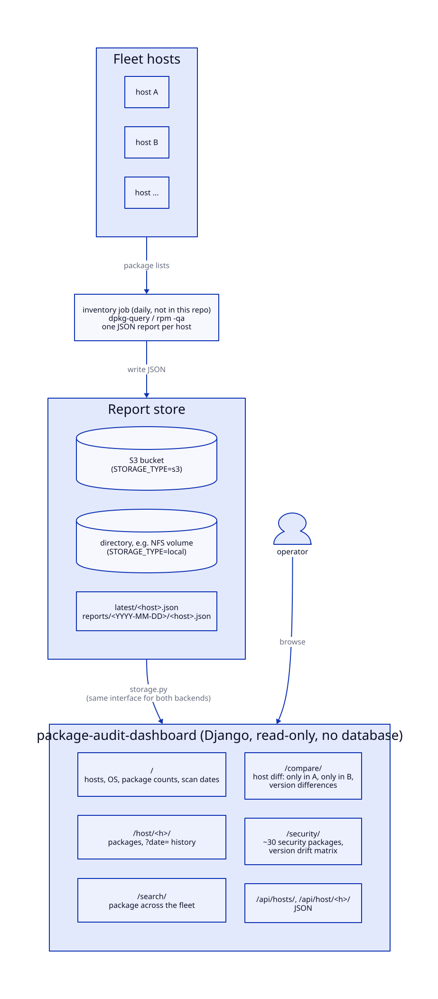

# package-audit-dashboard

A read-only Django dashboard over a fleet-wide installed-package inventory. A
scheduled job (not included here; in the source homelab it was an Ansible
playbook) writes one JSON report per host to S3 or to a shared filesystem. This
app lets you browse hosts, search for a package across the fleet, diff two
hosts, and see a version matrix of security-relevant packages that highlights
version drift.

It comes from a working homelab. Bucket, registry, NFS server and host names
are placeholders. `sample-data/` is synthetic.

## Architecture



Routes: `/` (hosts, OS, package counts, scan dates), `/host/<h>/` (packages,
`?date=<YYYY-MM-DD>` history), `/search/?q=` (substring match across hosts),
`/compare/` (only-in-A, only-in-B, version diffs), `/security/` (matrix of ~30
security packages), `/api/hosts/` and `/api/host/<h>/` (JSON), and `/health/`.

Report format (one file per host):

```json
{
  "hostname": "k3s-main",
  "os_distribution": "Ubuntu",
  "os_version": "22.04",
  "kernel": "5.15.0-100-generic",
  "scan_time": "2026-01-12T03:00:04Z",
  "package_count": 8,
  "packages": [ {"name": "openssl", "version": "3.0.2-0ubuntu1.15", "source": "apt"} ]
}
```

The storage backend is chosen at startup by `packages/storage.py`
(`LocalStorageClient` or `S3StorageClient`, same interface). The tracked
security package list is `SECURITY_PACKAGES` in `packages/views.py`.

## Running

Local, against the synthetic data:

```bash
python -m venv .venv && . .venv/bin/activate
pip install -r requirements.txt
cp .env.example .env            # STORAGE_TYPE=local, LOCAL_DATA_PATH=./sample-data
set -a; . ./.env; set +a
python manage.py runserver
```

Kubernetes (manifests use the local/NFS backend, mounted read-only):

```bash
docker build -t package-audit-dashboard .
kubectl apply -f k8s/namespace.yaml -f k8s/storage.yaml -f k8s/configmap.yaml
cp k8s/secret.yaml.example k8s/secret.yaml && $EDITOR k8s/secret.yaml   # git-ignored
kubectl apply -f k8s/secret.yaml -f k8s/deployment.yaml -f k8s/service.yaml
```

`k8s/storage.yaml` defines a static NFS PersistentVolume (`192.0.2.164:/export/packages`
is a placeholder). The deployment pulls from ECR with an `ecr-registry-key` pull
secret and is exposed on NodePort 30081. For the S3 backend, set
`STORAGE_TYPE=s3`, `S3_BUCKET` and `S3_REGION`, and provide AWS credentials
through any boto3 source.

## Layout

```
audit/                 Django project (settings, urls, wsgi)
packages/
  storage.py           LocalStorageClient / S3StorageClient + factory
  s3_client.py         earlier S3-only client (superseded by storage.py, unused)
  views.py, urls.py
  templatetags/        get_item filter for the security matrix
  templates/packages/  dashboard, host_detail, search, compare, security_packages
k8s/                   namespace, NFS PV/PVC, configmap, deployment, service, secret example
sample-data/           synthetic reports for local runs
Dockerfile             python:3.11-slim, non-root, gunicorn
```

## Notes

- Every page reads the per-host JSON files directly. That is fine for tens of
  hosts, but `/search/` and `/security/` read every report on each request.
- There is no authentication. Keep it on a trusted network or behind an
  authenticating proxy.

## Requirements

Python 3.11, Django 4.2, gunicorn, whitenoise, boto3 (S3 backend only).

## License

MIT. See [LICENSE](LICENSE).
